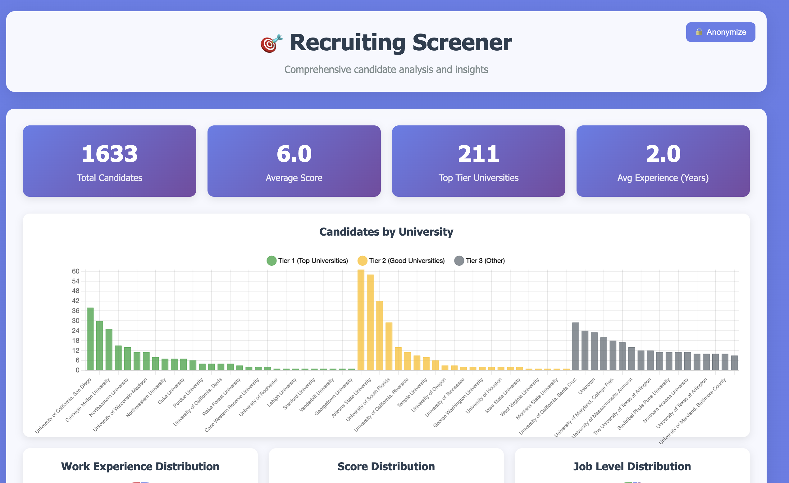

# 🎯 Resume Screening

A comprehensive llm-based resume extractor and web-based dashboard for screening and analyzing large amounts of candidate resumes (tested on thousands of resumes).

## 📸 Dashboard Preview



*Interactive dashboard showing candidate analytics, filtering, and detailed candidate profiles with privacy controls.*

## ✨ Key Capabilities

- **🤖 AI-Powered Extraction**: Convert unstructured resumes into structured candidate profiles using multiple LLM providers
- **📊 Intelligent Analytics**: Real-time insights with interactive charts and KPIs
- **🔍 Advanced Filtering**: AI-ranked search and multi-dimensional filtering
- **🎯 Batch Processing**: Handle hundreds or thousands of resumes efficiently
- **🔧 Fully Customizable**: Adapt extraction schema for any role or industry
- **🔒 Privacy Controls**: Built-in anonymization for demos and presentations

## 🚀 Quick Start

### Prerequisites
- Python 3.7+
- Resume files in directories (PDF format)
- LLM API access (one of: OpenAI, Groq, Anthropic, or Google)

### Installation & API Setup

1. **Install dependencies**:
   ```bash
   pip install -r requirements.txt
   ```

2. **Choose and configure your AI model**:
   
   The resume extractor supports multiple AI providers. Choose one and set up your API key:

   **🚀 Groq (Recommended - Fast & Free)**
   - Get free API key: https://console.groq.com/keys
   - Set environment variable:
     ```bash
     export GROQ_API_KEY="your_groq_api_key_here"
     ```
   - Model: `groq-llama-3.3-70b` (default)
   
   **🧠 OpenAI**
   - Get API key: https://platform.openai.com/api-keys
   - Set environment variable:
     ```bash
     export OPENAI_API_KEY="your_openai_api_key_here"
     ```
   - Model: `gpt-4`
   
   **🤖 Anthropic Claude**
   - Get API key: https://console.anthropic.com/account/keys
   - Set environment variable:
     ```bash
     export ANTHROPIC_API_KEY="your_anthropic_api_key_here"
     ```
   - Model: `claude-3-haiku`
   
   **🔍 Google Gemini**
   - Get API key: https://makersuite.google.com/app/apikey
   - Set environment variable:
     ```bash
     export GOOGLE_API_KEY="your_google_api_key_here"
     ```
   - Model: `gemini-2.0-flash`

   💡 **Tip**: Add the export command to your `~/.bashrc` or `~/.zshrc` to make it permanent.

3. **Extract candidate data from resumes**:
   
   The resume extractor analyzes PDF resume files using AI to extract structured data:
   
   ```bash
   # Basic usage with Groq (default) - analyzes all resumes in current directory
   python resume_extractor.py
   # Creates: candidates.csv
   
   # Test with a few resumes first (recommended)
   python resume_extractor.py --sample 5
   
   # Use different AI models
   python resume_extractor.py --model gpt-4               # OpenAI GPT-4
   python resume_extractor.py --model claude-3-haiku      # Anthropic Claude
   python resume_extractor.py --model gemini-2.0-flash    # Google Gemini
   
   # Analyze resumes in a specific folder
   python resume_extractor.py --directory resumes_batch_1
   
   # Custom output filename
   python resume_extractor.py --output applicants_2024.csv
   
   # Pass API key directly (alternative to environment variable)
   python resume_extractor.py --model gpt-4 --api-key YOUR_API_KEY
   
   # Combine options
   python resume_extractor.py --directory batch1 --output batch1_results.csv --model groq-llama-3.3-70b --sample 50
   ```
   
   **Supported AI Models:**
   - `groq-llama-3.3-70b` (default - free tier available)
   - `gpt-4` (requires OpenAI API key)
   - `claude-3-haiku` (requires Anthropic API key)
   - `gemini-2.0-flash` (requires Google API key)

3. **Start the dashboard server** (automatically generates resume paths):
   ```bash
   # Basic usage (uses candidates.csv by default)
   python serve_dashboard.py
   
   # Or specify a different CSV file
   python serve_dashboard.py my_candidates.csv
   
   # Advanced usage with custom resume directories and port
   python serve_dashboard.py candidates.csv --resume-dirs folder1 folder2 --port 8080
   ```

4. **Open your browser** and navigate to:
   ```
   # For default candidates.csv file:
   http://localhost:8003/recruiting_dashboard.html
   
   # For custom CSV file (replace 'your_file.csv' with your actual filename):
   http://localhost:8003/recruiting_dashboard.html?csv=your_file.csv
   
   # Examples:
   http://localhost:8003/recruiting_dashboard.html?csv=test_improved.csv
   http://localhost:8003/recruiting_dashboard.html?csv=applicants_2024.csv
   ```
   
   💡 **Important**: When using a custom CSV file, always include the `?csv=filename.csv` parameter in the URL, otherwise the dashboard will load the default `candidates.csv` file.

5. **Stop the server** when done:
   - Press `Ctrl+C` in the terminal

## 📋 Core Features

### 🤖 AI-Powered Resume Extraction
- **Multi-LLM Support**: Works with Groq, OpenAI, Anthropic, and Google AI models
- **Structured Data Extraction**: Converts unstructured resumes into standardized candidate profiles
- **Comprehensive Analysis**: Extracts 40+ data points including skills, experience, education, and accomplishments
- **Intelligent Scoring**: AI-generated aggregate scores (1-10) across 6 key dimensions relative to experience level
- **Batch Processing**: Efficiently processes hundreds or thousands of resumes
- **PDF Support**: Robust PDF text extraction with multiple fallback methods
- **Customizable Schema**: Easily modify extraction fields for different roles and industries

### 📊 Interactive Analytics Dashboard
- **Real-time Insights**: Instantly visualize extracted candidate data
- **KPIs**: Total # candidates, average scores, # from top-tier universities, experience distribution
- **Interactive Charts**:
  - Candidates by University (top 70, tier-sorted with color coding)
  - Work Experience Distribution across career levels
  - Overall Score Distribution for quality assessment
  - Job Level Distribution for role matching

### 👥 Advanced Candidate Management
- **AI-Ranked Results**: Candidates automatically sorted by overall AI-generated score
- **Intelligent Search & Filtering**: 
  - Real-time search across names, emails, universities, and skills
  - Multi-dimensional filtering by job level, university, and experience
  - Smart filtering preserves ranking while narrowing results
- **Information-Dense Cards**: Three-line layout showing essential candidate data at a glance
- **Direct Access**: One-click links to original resumes, GitHub profiles, and LinkedIn
- **Privacy Controls**: Toggle to anonymize sensitive information for demos and presentations

### 📋 Comprehensive Candidate Profiles
- **Complete Overview**: All extracted data organized in intuitive sections
- **Education Analysis**: Degrees, universities with tier rankings, GPAs, and academic strength
- **Experience Assessment**: Career progression, companies worked, programming/AI experience years
- **Technical Skills Matrix**: Detailed skill ratings across programming languages, frameworks, and tools
- **AI-Generated Scores**: Six aggregate scores comparing candidates relative to their experience level
- **Achievement Highlights**: Top 3 accomplishments extracted and ranked by AI

## 🛠️ Technical Implementation

### Technology Stack
- **Frontend**: Pure HTML/CSS/JavaScript (no frameworks required)
- **Charts**: Chart.js for interactive visualizations
- **Server**: Python HTTP server with CORS support
- **Data Processing**: CSV parsing with automatic type conversion
- **AI Integration**: Multiple LLM providers (Groq, OpenAI, Anthropic, Google)

### Design Features
- **Modern UI**: Glassmorphism design with gradient backgrounds
- **Responsive**: Works on desktop, tablet, and mobile
- **Interactive**: Hover effects, smooth transitions, real-time updates
- **Accessible**: Clear typography, good contrast, intuitive navigation

### Data Processing
- **Automatic Sorting**: Candidates ranked by overall score
- **Smart Filtering**: Multiple filter combinations
- **Real-time Search**: Instant results as you type
- **Data Validation**: Handles missing or invalid data gracefully
- **Resume Linking**: Automatic discovery and linking of resume files

## 📁 Project Structure

```
resume-screening/
├── recruiting_dashboard.html    # Main dashboard interface
├── serve_dashboard.py          # HTTP server with auto resume path generation
├── resume_extractor.py         # LLM-based resume parsing script
├── test_dashboard.py           # Dashboard verification tests
├── candidates.csv              # Candidate data (generated by resume_extractor.py)
├── requirements.txt            # Python dependencies
├── .gitignore                  # Git ignore rules (protects sensitive data)
├── LICENSE                     # MIT License
├── README.md                   # This documentation
└── [resume_directories]/       # Resume files (PDF)
```

## ⚙️ Configuration

### Resume Extractor Options

```bash
python resume_extractor.py [OPTIONS]

Options:
  --output FILE         Output CSV filename (default: candidates.csv)
  --directory DIR       Directory to search for resumes (default: current directory)
  --model MODEL         LLM model to use (default: groq-llama-3.3-70b)
  --api-key KEY         API key for the model provider
  --sample N           Process only N resumes (for testing)
  -h, --help           Show help message
```

### Dashboard Server Options

```bash
python serve_dashboard.py [CSV_FILE] [OPTIONS]

Arguments:
  CSV_FILE              CSV file with candidate data (default: candidates.csv)

Options:
  --resume-dirs DIR [DIR ...]   Directories to search for resume files 
                               (default: all subdirectories)
  --port PORT                  Port to serve on (default: 8003)
  -h, --help                   Show help message
```

### Configuration Examples

```bash
# Use default settings
python serve_dashboard.py

# Specify custom CSV file
python serve_dashboard.py my_data.csv

# Search only specific directories for resumes
python serve_dashboard.py candidates.csv --resume-dirs batch1 batch2

# Use custom port
python serve_dashboard.py --port 8080

# Combine options
python serve_dashboard.py applicants.csv --resume-dirs resumes_2024 --port 9000
```

## 🔧 Data Schema

The dashboard expects a CSV file with the following columns (as generated by `resume_extractor.py`):

### Core Information
- `resume_filename`: Original resume filename
- `candidate_name`: Full name of candidate
- `email`: Email address
- `github_link`: GitHub profile URL
- `linkedin_link`: LinkedIn profile URL
- `country`, `city`: Location information

### Education
- `highest_degree`: Highest degree obtained
- `bachelors_university`: Bachelor's university
- `graduate_university`: Graduate university
- `university_tier`: University tier (1-5)
- `bachelors_gpa`, `masters_gpa`: GPAs

### Experience
- `estimated_job_level`: Job level (Intern, MTS, AMTS, etc.)
- `programming_experience_years`: Years of programming experience
- `ai_experience_years`: Years of AI/ML experience
- `companies_worked`: List of companies
- `company_tier`: Company tier (1-5)

### Technical Skills
- `javascript_skill_level`, `python_skill_level`: Skill levels (1-5)
- `cloud_skill_level`, `llm_skill_level`: Cloud and LLM expertise
- `react_strength`, `typescript_strength`: Framework expertise
- `aws_services_experience`: AWS services used
- `database_technologies`: Database technologies

### Aggregate Scores
- `academic_strength`: Academic strength (1-10)
- `cs_strength`: CS fundamentals (1-10)
- `industry_strength`: Industry experience (1-10)
- `fullstack_strength`: Full-stack development (1-10)
- `opensource_strength`: Open source contributions (1-10)
- `accomplishments_strength`: Accomplishments (1-10)
- `overall_score`: Average of all scores

### Accomplishments
- `accomplishment_1`, `accomplishment_2`, `accomplishment_3`: Top achievements

### Customizable Fields

**Note:** The skill fields and scoring categories shown above (like `react_strength`, `typescript_strength`, etc.) are examples and can be fully customized in the `resume_extractor.py` script to match your specific requirements.

**Common Customizations:**
- **Technology Skills**: Add fields for specific programming languages, frameworks, or tools relevant to your roles
- **Industry Knowledge**: Include domain-specific expertise areas
- **Soft Skills**: Add categories for leadership, communication, problem-solving
- **Scoring Criteria**: Modify the 1-10 scale or add new aggregate scores
- **Company Information**: Adjust company tier definitions or add industry classifications

To customize fields, modify the `ResumeData` class in `resume_extractor.py`. The dashboard will automatically adapt to display any fields present in your CSV data.

## 🧪 Testing

Test your setup with the included test script:

```bash
# Test with default CSV file
python test_dashboard.py

# Test with custom CSV file
python test_dashboard.py my_data.csv
```

## 🔄 Data Updates

To update the candidate data:

1. Run `resume_extractor.py` to generate a new CSV file
2. Restart the dashboard server (automatically updates resume paths)
3. Refresh the browser page

The server automatically scans for resume files and updates paths on each startup.

## 🎨 Customization

The system can be customized at multiple levels:

### Data Schema Customization
- **Skills & Scoring**: Modify the `ResumeData` class in `resume_extractor.py` to add/remove fields
- **Scoring Criteria**: Adjust the 1-10 scales or add new aggregate scores  
- **Company Tiers**: Update company classification logic
- **University Rankings**: Modify university tier definitions

### Dashboard Customization
- **Styling**: Edit the CSS in `recruiting_dashboard.html`
- **Charts**: Modify chart configurations in the JavaScript section
- **Filters**: Add new filter options in the HTML and JavaScript
- **Columns**: Adjust which data is displayed in the candidate list
- **Scoring Display**: Update which scores are shown in the candidate cards

## 🛠️ Troubleshooting

### Common Issues

1. **"Error loading candidate data"**
   - Ensure your CSV file exists in the same directory
   - Check that the CSV file is properly formatted
   - Verify the file has the expected column headers

2. **"Port 8003 is already in use"**
   - Stop any existing server on port 8003
   - Or modify the PORT variable in `serve_dashboard.py`

3. **Charts not displaying**
   - Check internet connection (Chart.js is loaded from CDN)
   - Ensure JavaScript is enabled in your browser

4. **Dashboard not loading**
   - Verify you're accessing the correct URL
   - Check that the server is running
   - Look for error messages in the browser console

### Browser Compatibility
- Chrome/Chromium (recommended)
- Firefox
- Safari
- Edge

## 🤝 Contributing

To contribute to the dashboard:

1. Fork the repository
2. Create a feature branch
3. Make your changes
4. Test thoroughly
5. Submit a pull request

## 📄 License

This project is licensed under the MIT License - see the [LICENSE](LICENSE) file for details.

### MIT License Summary
- ✅ **Commercial use** - Use this software commercially
- ✅ **Modification** - Modify and customize the code
- ✅ **Distribution** - Distribute copies of the software
- ✅ **Private use** - Use the software privately
- ⚠️ **No warranty** - Software is provided "as is"
- ⚠️ **License notice** - Include license and copyright notice in copies

The MIT License is one of the most permissive open source licenses, allowing you to use this software for any purpose with minimal restrictions.

---

**Happy Recruiting! 🎯**